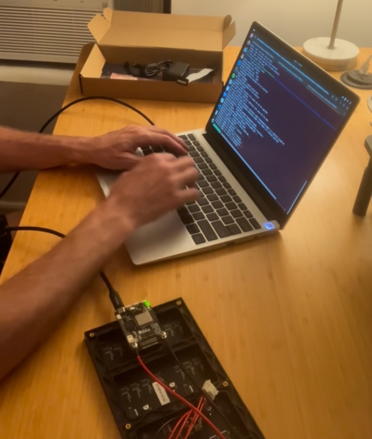

# Overview

Ever wanted to make your own tennis scoreboard? Never thought of it before but now you can't unthink it? Let us show you how! It's a super fun project that takes:
- A little bit of **coding** (we'll provide the code to you although it definitely helps to have some knowledge of Python or a similar language)
- Some **fabrication** (we'll tell you exactly what to do)
- And **patience** (can't help you there)

## Where we're headed

We're making this scoreboard:

    

It's a fun way to keep score while you're playing a match or to just have around the house.

## How much effort does this take?

- **Difficulty**: Low-medium.
- **Time commitment**: Expect to spend at least a couple hours on this for multiple days. Some steps are easy and just require patience (painting). Other steps, like testing the electronics, will be more involved.
- **Cost**: **$216.44**. You can also make a **cheaper version** without all the bells and whistles for **$69.95**. More on that later.

## How it works - high level

Here are the core components:

- An **LED panel** driven by a simple little computer called a "microcontroller".
- Code that we save **on that little computer** that can take your button presses and turn them into numbers that show up on the LED panel.
- **A frame** you'll 3D print to encase the LED and provide a home for the buttons.
- A **power supply** to keep the whole thing running.

## What you'll need

You need a few different things here:

- Some electronics you can purchase from [Adafruit](https://www.adafruit.com/).
- A power supply (either a power bank or a simple DC adapter if you have access to an outlet).
- Access to a 3D printer.
- Some basic tools (screwdriver, basic power drill).
- Paint.

### Electronics

Let's get into the electronics you'll need:

  

- Adafruit Matrix Portal Starter Kit (pictured above - [link](https://www.adafruit.com/product/4812)).
- Adafruit LED Arcade Button 1x4 QT I2C Breakout ([link](https://www.adafruit.com/product/5296)).
- STEMMA QT / Qwiic JST SH 4-Pin Cable - 50mm Long ([link](https://www.adafruit.com/product/4399)).
- 2 Mini LED Arcade Buttons (24mm) ([link](https://www.adafruit.com/product/3432)).
- Arcade Button Quick-Connect Wire Pairs (.11") ([link](https://www.adafruit.com/product/1152))
- USB C to USB C **data** cable ([link](https://www.adafruit.com/product/4812)).
- A power supply. 
    - The Adafruit Matrix Portal Starter Kit comes with a 5V power supply that you can plug into a regular wall outlet. But if you want your scoreboard to be mobile, we recommend purchasing a power bank. We used the [INIU B5 Power Bank](https://iniushop.com/products/iniu-megapower-20000mah-portable-charger) although many other power bank products would suffice here.

**Note:** This is where the cheaper version of this project comes into play. If you just want an LED you can use to display a scoreboard (or other messages), then all you'll  need is the Adafruit Matrix Portal Starter Kit at the top of the list. The other supplies listed there are for adding buttons that you can press to interact with the scoreboard. Similarly, everything in the following list is a nice-to-have but not strictly necessary. You could always mount your LED on a simple piece of plywood and skip the 3D printing. We just went the 3D printing route because it was fun!

### Other items you'll need (for the 3D-printed frame)

    

- Super glue.
- Baking soda.
- Paint. We recommend spray paint.
    - We used Montana primer, spray paint, and varnish. For the paint, we used **Montana Poison Light** spray paint (CL6310).
- 16 1/8" diameter bolts.

--------

# Ready, set, build

Okay, you've got your supplies. And now you're ready to build it. Let's get going!

We recommend setting up and testing the electronics first to make sure that your LED is working. The goal here is to:

1) Assemble the LED parts.
2) Load the custom scoreboard code we've provided onto the Matrix Portal M4.
3) Plug it in and make sure it's working.

## LED

### Assemble the LED

No point in rebuilding the wheel. And since Adafruit (a site wher you can buy electronics supplies and learn about others' projects) has generously published handy instructions on how to set up your Matrix Portal Starter Kit, we'll point you to the most relevant parts.

1. Follow along [here](https://learn.adafruit.com/adafruit-matrixportal-m4/prep-the-matrixportal) to set up the physical hardware.
2. Then, follow [these instructions](https://learn.adafruit.com/matrix-portal-flow-visualizer/install-circuitpython) so that you can run Python on your Matrix Portal M4 microcontroller. (Python is going to be critical here since that's the framework within which the custom code will run.)

Alright! Now your LED and the Matrix Portal M4 driving it have everything they need to start running some custom code... 

### Load the code

With your Matrix Portal M4 connected to your computer via the USB **data** cable you previously purchased, copy everything in the [custom-code folder](./custom-code/) and paste it directly into the home directory of your Matrix Portal M4 folder, like this:

    

The Matrix Portal M4 is set up to read whatever code is in `code.py` and run it.

### Test it!

  

That should do it! You've got your hardware setup, Python installed on the microcontroller, and custom code saved there. If the microcontroller is plugged into a power source (either your laptop or a wall outlet), you should see it running (i.e. text popping up on the LED).

## Frame construction

  

Your LED scoreboard is working and now you just need a way to prop the thing up and hold the buttons in place. Again, our method here is not the only way to go about this. We 3D printed our frame (design pictured above) but you could do a very simple plywood mount. But we'll walk you through our method here.

### Print 3D frame

  

We've gone ahead and designed a 3D model for you. So all you have to do is download the files in [3d-printed-frame-files](./3d-printed-frame-files/) and find a 3D printer where you can print each one with some **basic PLA** printer feed. Note that our frame comes in 5 parts: **2 halves of the main frame** along with **3 panels** to enclose the back of the scoreboard. So you'll need to print the `back-panel.stl` file 3 times (since you need 3 panel pieces to cover the entire back of the scoreboard). 

Finally, if you want to see the original 3D design, it's available [here](https://cad.onshape.com/documents/69ebf9ad50050bcc4d933ace/w/815e9d5b396a06dd19ee47ea/e/771d1e32a6c8bf09b2bf1eec?renderMode=0&uiState=68e6e3e470c44a081cd773cc).

(Why in 5 parts? -> We did it this way so that we could print on a 3D printer with a maximum 7"x7"x7" print area. We used a Bambu Lab A1 mini - pictured above - although most 3D printers should work.)

### Assembly

You've finished printing the pieces, so now you can assemble them. For now, we're just going to put the two main halves of the frame together.

  

  

Having a couple of long bar clamps and a couple spring clamps is really handy here although you can probably find a way to improvise. The main thing is that you'll need to superglue the two halves together and hold them in place as they dry to help the bond take. We also recommend sprinkling a little bit of baking soda on the area where the halves are being pressed together as baking soda helps a bond form between the two pieces of plastic.

### Paint it!

This is the fun part. We spray painted ours with Montana products:

  

We put on one layer of primer, one layer of paint (with a little bit of touching up), and one layer of varnish. And presto!

## Put it all together

You've got your LED panel working. And you have a painted frame for the LED. So now all you have to do is put it together!

We recommend watching our Instagram video [here](TBD) for a quick overview of what the final assembly process looks like. Here are the steps broken down:

1) Fit the LED into the printed frame making sure that the side of the LED where the Matrix Portal M4 is plugged in is aligned with the little window on the side of the frame.
2) Attach the LED to the frame by screwing the 1/8" bolts through the tabs in each corner of the frame into the LED's screw holes:

  

3) Connect the Matrix Portal M4 to your LED Arcade Button 1x4 QT I2C Breakout via the STEMMA QT / Qwiic JST SH 4-Pin Cable:

  

4) Connect each button to a pair of Quick-Connect wires.  
5) Slide the buttons through the button holders on the top of the frame.
6) Now connect the other end of the Quick-Connect wires to the LED Arcade Button 1x4 QT I2C Breakout. You may have to play around with this step a little to make sure you connect the correct button to the correct switch (based on the color of the button and the LED output). You'll want to use switches 1 and 2:

  

  

7) Before moving on to the final step, plug the Matrix Portal M4 into a power source and do some testing to make sure things are looking right.
8) Last thing, attach the back panels by screwing in the remaining bolts. And that's it!

Congratulations! You made your own scoreboard from scratch!

## Having trouble? Or have feedback/suggestions?

Email us at love@bageled.nyc or DM us [on Instagram](https://www.instagram.com/bagelednyc/) at @bagelednyc. We'd love to hear from you!
